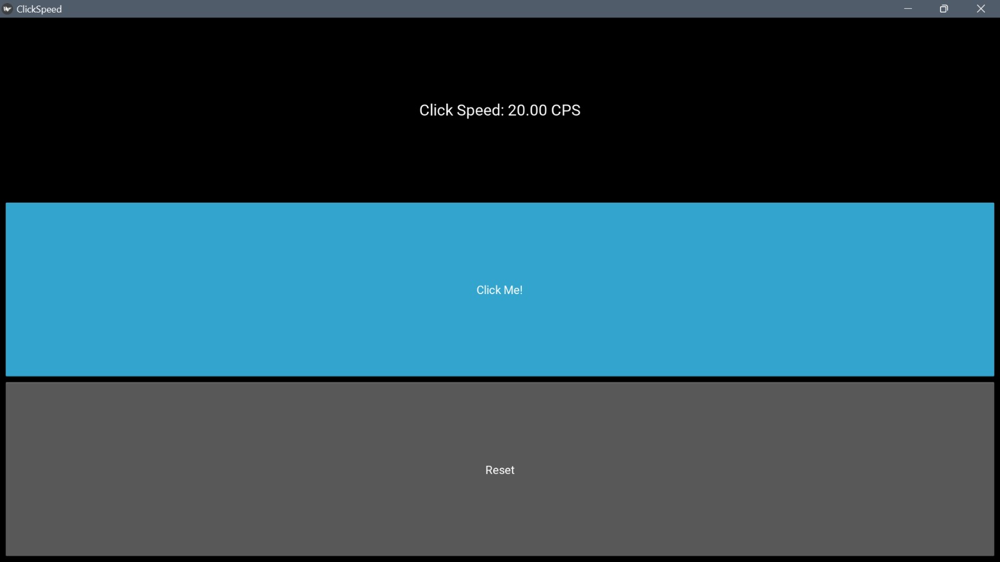

# Kivy Click Speed Counter

This is a simple Kivy-based application that counts clicks per second (CPS) and adjusts the count based on the clicking speed. It increases when you click and decreases when you stop clicking or click slower.



## Features

- Counts clicks per second (CPS).
- Adjusts the count based on clicking speed.
- Real-time CPS display.
- Reset button to clear the count.

## Requirements

- Python (>= 3.7)
- Kivy (>= 2.0.0)

## Getting Started

### Installation

1. Clone this repository:

   ```bash
   git clone https://github.com/your-username/kivy-click-speed-counter.git
   ```

2. Change to the project directory:

   ```bash
   cd kivy-click-speed-counter
   ```

3. Install the required dependencies (Kivy):

   ```bash
   pip install kivy
   ```

### Usage

1. Run the application:

   ```bash
   python main.py
   ```

2. Click the "Click Me!" button to start counting clicks per second.
3. The CPS value will increase when you click faster and decrease when you stop clicking or click slower.
4. You can reset the count by clicking the "Reset" button.


## Acknowledgments

- This app was created as a sample application for learning Kivy.
- Thanks to the Kivy community for their contributions and support.

## Contact

If you have any questions, suggestions, or issues, please feel free to contact [Rafael Campos Oviedo](mailto:oviedo.campos2006@gmail.com).
